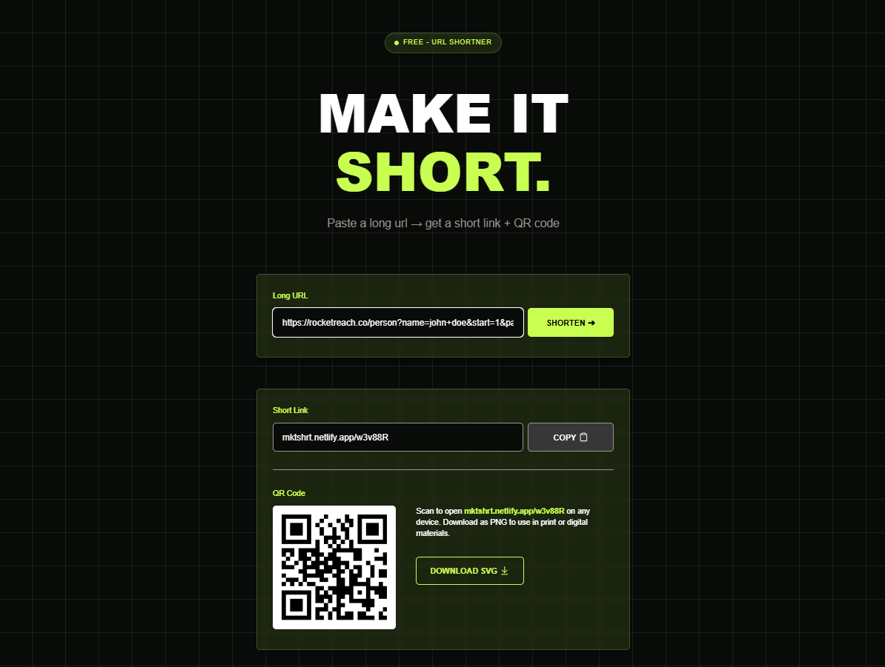

<div align="center">

# 🚀 MKTSHRT

### A modern, lightning-fast URL shortener built with Next.js.

Turn long URLs into clean, shareable links with downloadable QR codes.

<p>


</p>

<p>

[🌐 Live Demo](https://mktshrt.netlify.app)
•
[⭐ Star this Repo](../../stargazers)

</p>

---



</div>

---

# ✨ Features

- 🔗 Generate short URLs instantly
- 📱 Automatically generate QR Codes
- ⬇️ Download QR Codes as SVG
- ⚡ Fast server-side redirects
- 📈 Click tracking
- 🎨 Modern responsive UI
- 🌙 Clean dark theme
- 🔓 No authentication required
- 💚 Fully open source

---

# 🛠 Tech Stack

| Frontend | Backend | Database | Deployment |
|----------|----------|----------|------------|
| Next.js | Route Handlers | PostgreSQL | Netlify |
| TypeScript | Prisma ORM | Neon | |
| Tailwind CSS | | | |

---

# 📦 Project Structure

```
├── app
│   ├── [shortCode]
│   │   └── route.ts
│   ├── api
│   │   └── shorten
│   │       └── route.ts
│   ├── components
│   │   └── home
│   │       ├── Hero.tsx
│   │       ├── Label.tsx
│   │       ├── OutputBox.tsx
│   │       └── URLinput.tsx
│   ├── constants
│   │   └── Domain.ts
│   ├── functions
│   │   └── generateCode.ts
│   ├── generated
│   ├── lib
│   │   ├── apiClient.ts
│   │   ├── linkEndpoints.ts
│   │   └── prisma.ts
│   ├── globals.css
│   ├── layout.tsx
│   └── page.tsx
├── prisma
│   ├── migrations
│   └── schema.prisma
├── public
├── .gitignore
├── README.md
├── eslint.config.mjs
├── netlify.toml
├── next.config.ts
├── package-lock.json
├── package.json
├── postcss.config.mjs
├── prisma.config.ts
└── tsconfig.json
```

---

# ⚙️ Running Locally

Clone the repository

```bash
git clone https://github.com/HasanAlasker/Shorter_Link.git
```

Enter the project

```bash
cd my-app
```

Install dependencies

```bash
npm install
```

Create an environment file

```env
DATABASE_URL=
NEXT_PUBLIC_BASE_URL=http://localhost:3000
```

Run Prisma

```bash
npx prisma migrate dev
```

Start the development server

```bash
npm run dev
```

---

# 🗄 Database Schema

```prisma
model Link {
  id           String   @id @default(cuid())
  originalLink String   @unique
  shortCode    String   @unique
  clicked      Int      @default(0)
  createdAt    DateTime @default(now())
}
```

---

# 🚀 How It Works

```text
Long URL
    │
    ▼
Generate Unique Short Code
    │
    ▼
Save to PostgreSQL
    │
    ▼
Generate QR Code
    │
    ▼
Return Short URL
    │
    ▼
User Visits Link
    │
    ▼
Increment Click Counter
    │
    ▼
Redirect to Original URL
```

---

# 💡 Why I Built This

I wanted a small weekend project that would let me explore the complete lifecycle of a modern web application—from building a polished UI with Next.js and Tailwind CSS to working with Prisma, PostgreSQL, and deployment on Neon and Netlify.

Although the application is intentionally simple, it helped me gain practical experience with database design, server-side routing, URL redirection, QR code generation, and production deployment.

---

# 📈 Future Improvements

- Custom aliases
- Link expiration
- Analytics dashboard
- Password-protected links
- Bulk URL shortening
- Rate limiting
- Docker support

---

# ❤️ Open Source

Contributions, ideas and improvements are always welcome.

If you enjoy this project, consider leaving a ⭐.

---

<div align="center">

Made with ❤️ using Next.js

</div>
